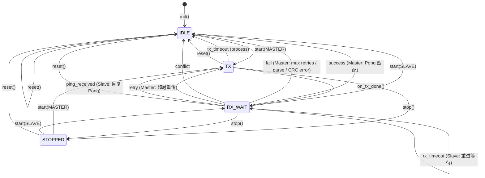

# PingPong 中间件设计准则（主从一体版）

## 1. 核心设计哲学

| 原则 | 说明 |
|------|------|
| **单一职责** | 只实现 Ping-Pong 协议的核心逻辑，不做任何其他事 |
| **依赖倒置** | 不依赖任何外部模块，外部模块依赖 PingPong 的接口 |
| **零知识原则** | 对硬件、事件总线、日志、按键、Radio 一无所知 |
| **被动驱动** | 所有输入来自外部调用，所有输出通过回调通知 |
| **主从一体** | 同一实例可动态配置为 Master 或 Slave，角色启动时固定 |
| **状态角色分离** | 状态表示协议阶段，角色表示设备身份，两者正交 |

## 2. 边界准则

### 2.1 该在 PingPong 内

- 状态机、超时计算、重传逻辑
- Ping/Pong 包编解码
- Master/Slave 角色管理
- 统计信息（原始计数）
- 冲突检测与上报

### 2.2 不该在 PingPong 内

- 硬件访问（GPIO/SPI/Radio）
- 事件总线订阅/发布
- 日志输出实现
- 角色冲突解决策略
- 业务决策（如是否重启新一轮）

## 3. 状态与角色定义

### 3.1 状态机（Mermaid 可视化）



### 3.2 状态（协议阶段）

| 状态 | 说明 |
|------|------|
| IDLE | 空闲 |
| TX | 发送阶段 |
| RX_WAIT | 等待接收阶段 |
| STOPPED | 已停止 |

### 3.3 角色（设备身份）

| 角色 | 说明 |
|------|------|
| NONE | 未确定 |
| MASTER | 主设备，主动发送 Ping，负责重传 |
| SLAVE | 从设备，被动回复 Pong |

## 4. 时间准则

- 时间通过端口层的 `get_time_ms` 函数指针注入
- PingPong 内部按需调用获取当前时间
- 超时计算使用差值比较，支持时间戳回绕

## 5. 端口抽象

端口结构体包含以下函数指针和成员：
- `get_time_ms`：获取当前时间戳（毫秒），必须实现
- `notify`：通知回调（带 `user_data` 第三参数），必须实现
- `user_data`：用户上下文指针，传入 `notify` 回调
- `trace`：可选 Debug Trace 钩子（NULL=不输出），用于状态转换跟踪

## 6. 通知类型

| 通知 | 说明 |
|------|------|
| TX_REQUEST | 请求发送包（携带缓冲区指针和大小） |
| RX_REQUEST | 请求进入接收模式 |
| SUCCESS | Ping-Pong 成功 |
| FAIL | Ping-Pong 失败（`fail_reason` 指明原因：超时/重试耗尽/解析错误/CRC 错误/TX 超时/冲突） |
| RX_TIMEOUT | 接收超时（仅 Slave） |

> **注意**：重传只更新内部统计（`retry_count`），不单独发出通知。冲突通过 FAIL 通知上报（`fail_reason = PING_PONG_FAIL_REASON_CONFLICT`）。

## 7. 公开 API

| 函数 | 说明 |
|------|------|
| `instance_size` | 获取实例所需内存大小（无参数，TX 缓冲区由编译时 `PING_PONG_TX_BUFFER_SIZE` 决定） |
| `init` | 初始化，注入端口 |
| `set_config` | 设置配置（必须在 start 前调用） |
| `start` | 以指定角色启动 |
| `stop` | 停止协议 |
| `reset` | 重置统计和状态 |
| `process` | 轮询处理（超时检测） |
| `on_tx_done` | 发送完成通知 |
| `on_rx_done` | 接收完成通知 |
| `get_state` | 获取当前状态 |
| `get_role` | 获取当前角色 |
| `get_stats` | 获取统计信息 |
| `is_valid` | 检查实例是否已正确初始化 |

## 8. 配置参数

`ping_pong_init()` 时自动填充默认值，可通过 `ping_pong_set_config()` 在 `start` 前覆盖。

**运行时配置（`ping_pong_config_t`）：**

| 参数 | 说明 |
|------|------|
| `max_retries` | Master 最大重传次数（Slave 忽略） |
| `rx_timeout_ms` | 等待 Ping/Pong 超时（Master 必须>0，Slave 0=永不超时） |
| `tx_timeout_ms` | TX 状态超时保护（0 表示不检测，Master/Slave 通用） |

**编译时常量（可通过 `-D` 覆盖）：**

| 宏 | 默认值 | 说明 |
|----|--------|------|
| `PING_PONG_TX_BUFFER_SIZE` | `PING_PONG_MIN_PACKET_SIZE` (6) | 发送缓冲区大小 |
| `PING_PONG_DEFAULT_MAX_RETRIES` | 3 | 默认最大重传次数 |
| `PING_PONG_DEFAULT_RX_TIMEOUT_MS` | 3000 | 默认接收等待超时（毫秒） |
| `PING_PONG_DEFAULT_TX_TIMEOUT_MS` | 3000 | 默认 TX 状态超时保护（毫秒） |
| `PING_PONG_MAX_TIMEOUT_MS` | 600000 | 超时上界（10 分钟） |
| `PING_PONG_MAX_RETRIES` | 255 | 重试次数上界 |

## 9. 统计信息

| 字段 | 说明 |
|------|------|
| `success_count` | 成功次数 |
| `fail_count` | 失败次数 |
| `retry_count` | 重传次数 |
| `tx_count` | 发送次数（Master=Ping， Slave=Pong） |
| `rx_count` | 有效接收次数（Master=Pong， Slave=Ping） |
| `conflict_count` | 冲突次数 |
| `last_rtt_ms` | 最近一次 RTT（仅 Master） |
| `last_rssi` | 最近一次收包 RSSI |
| `last_snr` | 最近一次收包 SNR |

## 10. 资源准则

- 零动态内存，上下文由调用者静态分配
- 所有函数立即返回，无阻塞
- 单线程模型，不可重入
- 上下文大小不超过 256 字节

## 11. 错误处理

所有 API 返回 `ping_pong_err_t` 枚举：

| 错误码 | 值 | 说明 |
|--------|-----|------|
| `PING_PONG_OK` | 0 | 成功 |
| `PING_PONG_ERR_NULL_PTR` | -1 | 空指针参数 |
| `PING_PONG_ERR_NOT_INITIALIZED` | -2 | 实例未初始化 |
| `PING_PONG_ERR_INVALID_STATE` | -3 | 当前状态不允许此操作 |
| `PING_PONG_ERR_INVALID_PARAM` | -4 | 参数无效 |

| 场景 | 处理方式 |
|------|---------|
| 未初始化调用 | 返回 `ERR_NOT_INITIALIZED` |
| 非法状态转换 | 返回 `ERR_INVALID_STATE` |
| 解析失败 | 上报 FAIL（PARSE_ERROR） |
| CRC 校验失败 | 上报 FAIL（CRC_ERROR） |
| Master 超时 | 重传或上报 FAIL |
| TX 超时 | 上报 FAIL（TX_TIMEOUT） |
| Slave 超时 | 上报 RX_TIMEOUT |
| 角色冲突 | 上报 CONFLICT，上层决策 |

## 12. 包格式

```
+--------+---------+---------+----------+---------+---------+
| type   | seq_hi  | seq_lo  | reserved | crc_hi  | crc_lo  |
| 1 byte | 1 byte  | 1 byte  | 1 byte   | 1 byte  | 1 byte  |
+--------+---------+---------+----------+---------+---------+
```

- **type**: `0x01` = PING, `0x02` = PONG
- **seq**: 16-bit 序列号（大端）
- **crc**: CRC-16 CCITT（初始值 0xFFFF，多项式 0x1021，计算范围为前 4 字节）

## 13. 依赖关系

```
装配层（main.c）
    ↓ 依赖
PingPong 模块
    ↓ 依赖
无
```

PingPong 对外部模块的依赖数量为零。

## 14. 装配层职责

- 实现 `get_time_ms` 和 `notify` 回调
- 分配上下文和发送缓冲区
- 配置并启动 PingPong
- 主循环调用 `process`
- 响应 Radio 事件并调用 `on_tx_done` / `on_rx_done`
- 根据通知执行业务逻辑（如 Master 收到 SUCCESS/FAIL 后重启 start，Slave 收到 RX_TIMEOUT 后重启 start）
- **不在回调中直接调用 PingPong API**（避免重入），使用标志位或事件队列

## 15. 一句话总结

**PingPong 只做协议：状态机加编解码加超时重传加主从角色管理，时间通过端口注入，事件通过回调通知，冲突上报后由上层决策，对一切硬件和业务逻辑一无所知。**

---

*文档版本：5.1*
*最后更新：2026-04-14*